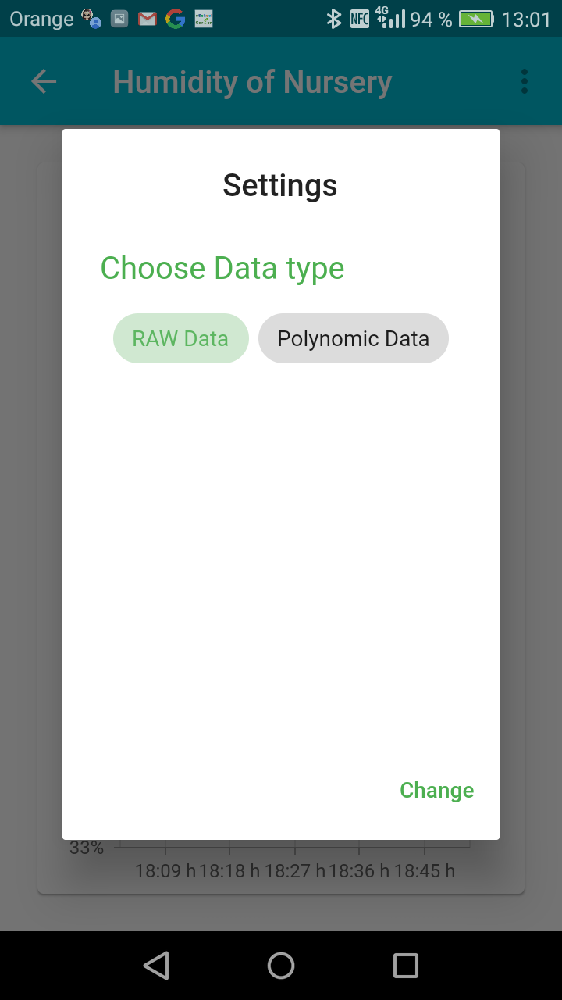
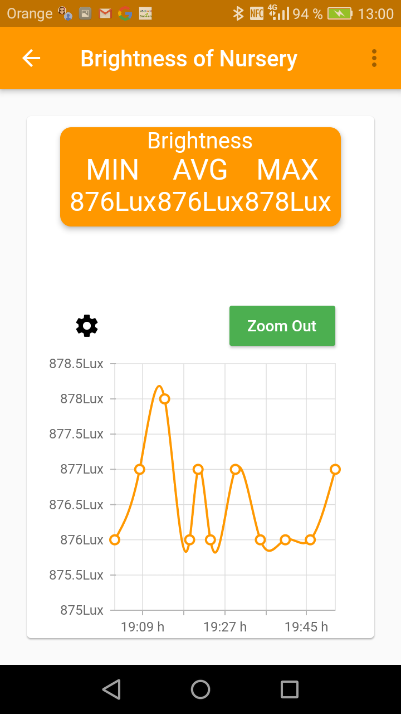
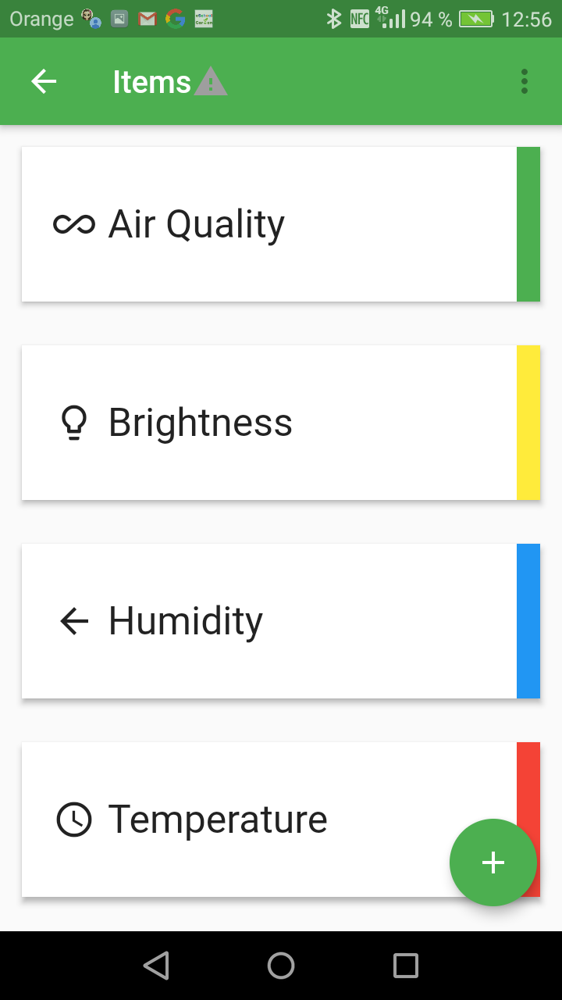
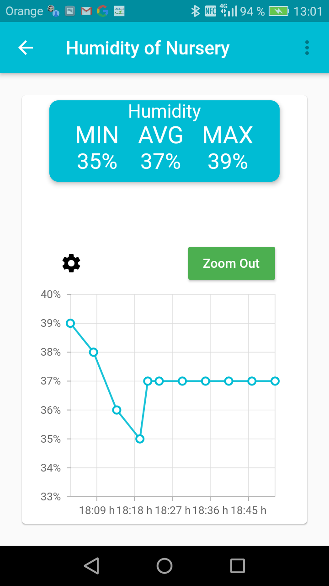
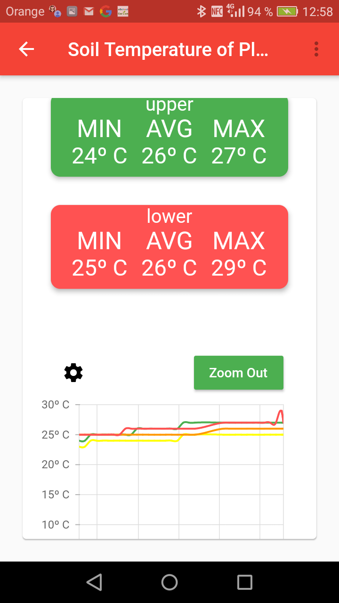

# EsGarden Android App

La aplicación desarrollada en este repositorio forma parte del proyecto educativo  “eSchoolGarden: School Gardens for Future Citizens” (Erasmus+ 2018-ES01-KA201-050599), que trata de educar en valores de sostenibilidad, eficiencia y respeto por el medio ambiente a los estudiantes de distintas partes del mundo por medio de tecnologías aplicables en un jardín. Se pueden consultar todos los detalles del proyecto a través del siguiente link: https://esgarden.blogs.upv.es/

El sistema desarrollado permite visualizar en tiempo real el estado de los múltiples jardines, divididos en parcelas. Además, ofrece una serie de gráficas que facilitan el entendimiento de los cambios que se producen y que son detectados por los sensores. 

                   

                  

## Requisitos

Esta aplicación se ha desarrollado en Flutter con Android Studio. Por ello, para poder trabajar con el proyecto, siga las instrucciones del siguiente Link para instalar Flutter en Android Studio: https://flutter.dev/docs/get-started/editor?tab=androidstudio.

La integración con Firebase es esencial para el correcto funcionamiento de la aplicación. Para ello será necesario crear un usuario y un proyecto de Base de datos en Firebase, como se describe en el siguiente tutorial: << Falta link >>. Después, habrá que importar el modelo funcional en formato .json a la base de datos, que simplemente se realizará desde la base de datos de Firebase recién creada, en la esquina superior derecha, en el menú de configuración de esta. Aquí aparecerá una opción llamada "Import Json". Seleccione el archivo .json correspondiente y habrá importado correctamente la base de datos.

# EsGarden Android App [ENGLISH]

The application developed in this repository is part of the educational project “eSchoolGarden: School Gardens for Future Citizens” (Erasmus+ 2018-ES01-KA201-050599), which aims to educate students around Europe in values of sustainability and respect for the environment through STI technologies applicable in a garden. More details of the project in the following link: https://esgarden.blogs.upv.es/

                   

                  

## Requeriments

The application developed in this repository allows to visualize in real time the state of a school garden, divided into plots for different vegetables, weather parameters as well as compost and seed nursery ambient parameters. Data is offered in series of graphs that facilitate the understanding of variations that occur and that are detected by the sensors deployed in your garden.

The APP must be linked with a suitable database in FireBase platform which structure is described in “Firebase database structure.pdf”.
