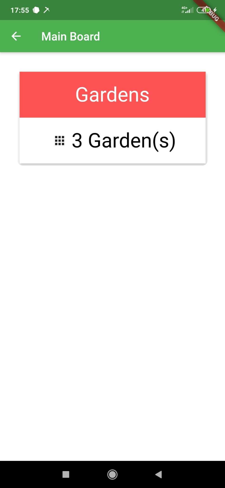
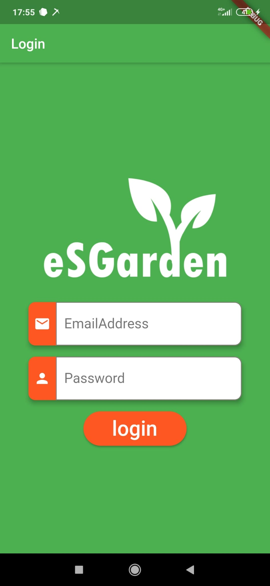
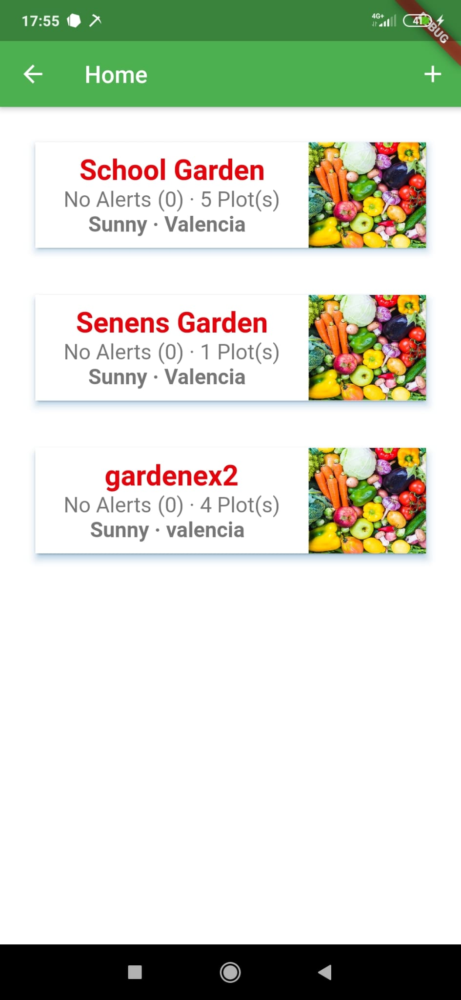
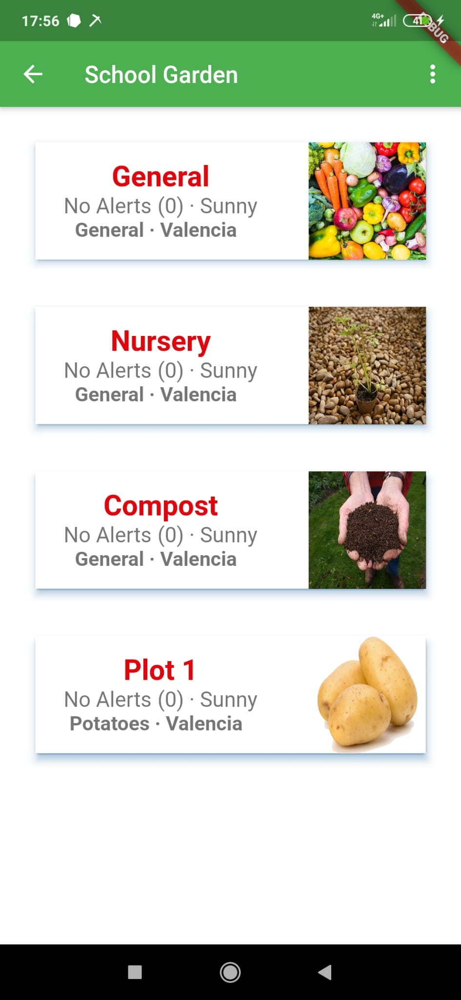

# EsGarden Android App

  

La aplicación desarrollada en este repositorio forma parte del proyecto educativo ESchoolGarden, que trata de educar en valores de sostenibilidad, eficiencia y respeto por el medio ambiente a los estudiantes de distintas partes del mundo por medio de tecnologías aplicables en un jardín. Se pueden consultar todos los detalles del proyecto a través del siguiente link: https://eschoolgarden.eu/ 

La aplicación permite visualizar en tiempo real el estado de los múltiples jardines, divididos en parcelas. Además, ofrece una serie de gráficas que facilitan el entendimiento de los cambios que se producen y que son detectados por los sensores. 

                   

## Requisitos

Esta aplicación se ha desarrollado en Flutter con Android Studio. Por ello, para poder trabajar con el proyecto, siga las instrucciones del siguiente Link para instalar Flutter en Android Studio: https://flutter.dev/docs/get-started/editor?tab=androidstudio.

La integración con Firebase es esencial para el correcto funcionamiento de la aplicación. Para ello será necesario crear un usuario y un proyecto de Base de datos en Firebase, como se describe en el siguiente tutorial: << Falta link >>. Después, habrá que importar el modelo funcional en formato .json a la base de datos, que simplemente se realizará desde la base de datos de Firebase recién creada, en la esquina superior derecha, en el menú de configuración de esta. Aquí aparecerá una opción llamada "Import Json". Seleccione el archivo .json correspondiente y habrá importado correctamente la base de datos.

